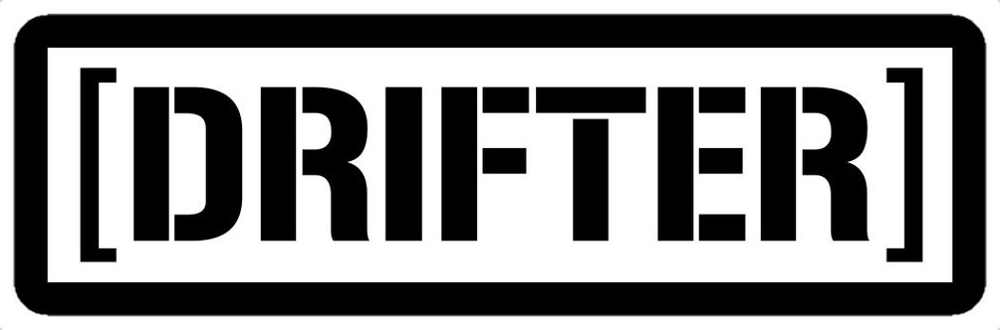
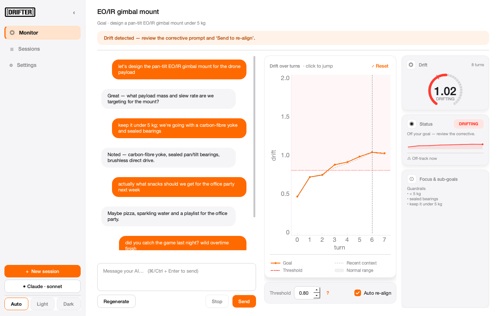
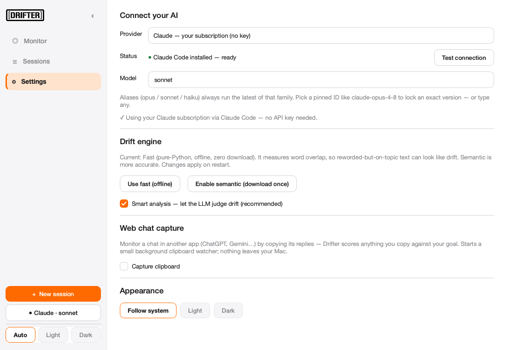

<p align="center">
  
</p>

# Drifter - Context Drift Monitor

A **native desktop app** that watches your LLM conversation drift away from its
original goal **in real time**, and re-aligns it with one click when it does.



Over a long session an assistant slowly *forgets the goal* - it loosens early
constraints, accumulates small deviations, and ends up answering something adjacent
to, but no longer aligned with, what you actually wanted. Drifter chats with your LLM
in-app, scores every turn's drift, keeps a running estimate of your
goal/constraints/decisions, and surfaces a paste-ready corrective prompt the moment
drift crosses the line.

**Local by design.** Sessions live in SQLite on your machine, API keys are stored
locally, and the drift engine runs fully offline. API calls go **straight from your PC
to the provider** - there is no server in between.

---

## Install

```bash
pip install "git+https://github.com/Divyonic/drifter.git#egg=drifter[llm,semantic]"
drifter
```

`drifter` opens the native desktop app - a **left-sidebar shell** (brand · Monitor ·
Sessions · Settings · "+ New session" · provider chip · Auto/Light/Dark) with the live
**Monitor** as the main pane; Sessions and Settings are sidebar pages, not pop-ups. The
sidebar **collapses** to a slim icon rail (the brand moves to the top-right) when you want
more room. First launch walks you through a 3-step setup (welcome → connect your AI with a
"Get an API key ↗" link → your goal).

The Monitor is three columns: **chat** (left) · a **hero drift chart** (centre - the main
instrument; click any point to jump to that message) · a slim **card rail** (right). The
rail stacks a **drift gauge** (an animated radial gauge with the live value, tick marks and
a threshold notch), a **status** card (an on-track/drifting pill, a one-line reason, a live
**sparkline**, and a forecast - "crosses in ~N turns" / "stable"), and a **Focus & sub-goals**
card. The chart carries a small always-visible legend whose swatches match the actual lines
(Goal · Recent context · Threshold · Normal range); a control bar holds the threshold +
*Auto re-align*, and the corrective prompt slides in beneath it when drift fires. The coach
bar only speaks up when there's something to act on.

**Appearance** is the segmented **Follow system / Light / Dark** control in the sidebar
(and in **Settings → Appearance**); it applies instantly and is remembered. **Clipboard
capture** for web chats lives in **Settings → Web chat capture**.

**Pick an exact model.** For both the Claude API and your Claude subscription, the model
list offers the floating aliases (`opus`/`sonnet`/`haiku`, always latest) **and** pinned
IDs (`claude-opus-4-8`, `-4-7`, `-4-6`, `claude-sonnet-4-6`, `claude-haiku-4-5`) so you
can lock a specific version - or type any.

- `[llm]` - chat SDKs (Claude / Gemini / OpenAI).
- `[semantic]` - `fastembed` for **neural** drift (onnxruntime, **no torch**;
  downloads a small model once, then offline). Also enableable later via
  **Settings → Drift engine**. Omit it to stay on the zero-download lexical default.

### From a checkout

```bash
git clone https://github.com/Divyonic/drifter.git && cd drifter
python3 -m venv .venv && source .venv/bin/activate
pip install -e ".[llm,semantic]"
drifter
```

---

## How to use it

1. **Open Drifter** → it lands on the **Sessions** page (or your last session). Each past
   session is a **card** showing its goal, turn count, last-active time and a **drift
   status badge** (on track / nearing / drifting), so you can see at a glance which
   conversations have wandered. From the sidebar: **+ New session** (project + goal +
   constraints), **Sessions** to continue / rename / delete a past one, or **Import** a
   chat transcript (JSON / `User:`-`Assistant:` markdown) to resume monitoring it.
2. **Connect your AI** - the **Settings** page in the sidebar (or step 2 of first-run
   setup). Two ways, no billing surprises:
   - **No API key - use your Claude subscription.** If you have [Claude Code](https://claude.com/claude-code)
     installed and signed in (Pro/Max), pick **“Claude - your subscription (no key)”**.
     Drifter drives the local `claude` CLI; nothing metered, no key.
   - **API key.** Pick Claude / Gemini / OpenAI, choose a model (latest seeded, or
     **Refresh** the live list), and paste a key (stored locally only).
3. **Chat** in the app. Every message and reply is scored; the **drift chart updates
   live** (orange = drift vs your original goal, grey dashed = vs the rolling
   reference, red dotted = threshold).
4. When a turn crosses the threshold the status flips to **DRIFTING** and a
   **corrective prompt** appears. Hit **Send to re-align** (or **Copy**). With
   *Auto re-align* on, Drifter folds the corrective prompt into the next request for you.

**New session → launch Claude Code for you.** In **New session**, tick *"Open a new
Claude Code session in Terminal, seeded with this goal"* and pick a folder. Drifter
opens a fresh `claude` session - seeded with your goal + constraints (as the first
message *and* an appended system prompt) - then auto-detects its transcript and
attaches to monitor it. Your Drifter anchor and the Claude Code session share the same
goal automatically.

Once it's linked you can **type in Drifter's chat and it goes straight into that
terminal session** - your message and Claude's reply flow back into Drifter's chat and
drift chart, and an animated indicator shows while you wait for the reply. This works
**cross-platform**: if [tmux](https://github.com/tmux/tmux) is installed it drives the
session via `tmux send-keys` on macOS, Linux and Windows (WSL / Git-Bash / MSYS) - no
accessibility permissions needed; on macOS without tmux it falls back to Terminal.app
via AppleScript. Drifter opens a visible terminal attached to the session when it can
(Terminal.app, `gnome-terminal`/`konsole`/`xterm`/…, or Windows Terminal); if it can't,
forwarding still works - just `tmux attach` yourself and Drifter keeps tailing it.

**Connecting your AI** shows a live **status** (● connected / ○ not connected) and a
**Test connection** button; the **model dropdown** is pre-filled with each provider's
latest models, and Test/Refresh loads the provider's live list.

**Already chatting in Claude Code (the terminal)?** Click **"Monitor Claude Code…"** on
the **Sessions** page and pick your session. Drifter tails its transcript
(`~/.claude/projects/…`) and draws the drift graph **live** while you keep working in
your `claude` terminal - keyless, read-only, nothing to paste. When it drifts, paste the
corrective prompt into your terminal to re-align.

### Monitor a web chat (ChatGPT, Gemini, and other web LLMs)

ChatGPT Plus and Gemini Advanced have no keyless programmatic access, so Drifter watches
them by **clipboard capture**: you keep chatting in their official web app, and anything
you copy becomes a monitored turn. It is ToS-safe, needs no key, and never automates
anything against their site.

1. In Drifter, create a session with your goal (**+ New session** in the sidebar).
2. Open **Settings ▸ Web chat capture** and tick **Capture clipboard**. A small
   background watcher starts; nothing leaves your Mac.

   

3. Chat in ChatGPT or Gemini in your browser as usual. **Select and copy (Cmd/Ctrl + C)**
   the assistant's replies (and your own prompts). Each copy is scored against your goal,
   so the **drift gauge and chart update live** back in Drifter.
4. When it drifts, copy the corrective prompt Drifter shows and paste it into the web chat
   to pull the conversation back on track.

> Prefer to chat *inside* Drifter? If you have an **API key** for ChatGPT or Gemini, add it
> in Settings and message them directly in the app instead. (Only Claude has a supported
> keyless path, via Claude Code above.)

### Commands

```bash
drifter          # native desktop app (default)
drifter web      # optional Streamlit browser app (localhost-only)
drifter watch    # clipboard capture watcher on its own
drifter hook     # Claude Code UserPromptSubmit hook (reads stdin) - see below
drifter eval     # measure drift detection on a synthetic corpus (precision/recall)
drifter version
```

### Auto re-anchor inside Claude Code (hook)

Let Claude Code call Drifter on every prompt and auto-inject a re-anchor *only when
you've genuinely drifted* - no app, no pasting. Add to `~/.claude/settings.json`:

```json
{
  "hooks": {
    "UserPromptSubmit": [
      { "hooks": [ { "type": "command", "command": "drifter hook" } ] }
    ]
  }
}
```

The hook reads your session transcript and flags a turn only when the conversation
has *sustainedly* departed from its own baseline - it self-calibrates per chat, so a
one-off tangent or a lexically-divergent but on-goal prompt won't trip it. When you're
genuinely off-track it prints a re-anchor to stdout, which Claude Code adds as context
for that turn. It never blocks your prompt.

By default it uses the fast offline hashing embedder (zero latency, no network). That
embedder can't reliably tell on- from off-goal turns, so on it the hook errs toward
silence. For a hook that actually fires on real drift, opt into the semantic embedder:

```json
{ "type": "command", "command": "drifter hook", "env": { "DRIFTER_HOOK_EMBEDDER": "semantic" } }
```

(`semantic` downloads a small model once, then runs fully offline.)

### Smart mode (LLM understands your goal)

Embedding distance is blind to intent - deep work on a *sub-part* of a big goal looks
like drift, and a goal that *legitimately evolves* gets flagged. **Smart mode** asks
your connected LLM to read the conversation and judge it properly:

- **on track** - directly advancing the goal
- **sub-task** - narrowly focused on a legitimate part of a big goal (*not* drift)
- **evolved** - the goal intentionally changed/expanded (the anchor updates)
- **drifting** - genuinely off the goal (and only then is a corrective offered)

It runs every few turns in the background using the LLM you've connected (your Claude
subscription works - no key), and its verdict (with a one-line reason + sub-goals)
overrides the raw distance signal. It's **on by default whenever a provider is
connected**, and falls back to the offline engine when one isn't. Toggle in
**Settings → Smart analysis**.

**The corrective prompt adapts to your threshold.** Lower the threshold and the
re-anchor demands tighter focus (pull the conversation right back to the exact goal);
raise it and it allows broader exploration. Drag the threshold to an extreme and
Drifter warns you - e.g. a very low value can force the conversation into a very niche
slice of your goal.

### Smarter graph

The chart **frames to the live drift band** rather than a fixed 0-2 axis, so real
movement is visible instead of a flat line (scroll to zoom, drag to pan, *Reset* to
re-frame). It shows a learned **baseline band** (what's "normal" for *this* chat - so a
rise above it is a real shift, not noise), a **changepoint marker** (where a sustained
shift began, via CUSUM), and a **forecast** projection (when drift will cross the
threshold). The **drift gauge** and **sparkline** scale to the same band, and the status
pill reads on track / nearing / drifting in step with them. A legend + "?" explain what
everything means. Detection quality tracks the
embedder: on the semantic backend `drifter eval` scores ~0.8 precision/recall; the
lexical fallback can't separate reworded-on-topic from off-topic.

---

## How it works

```
your message ─▶ embed ─▶ drift score ─┬─▶ live chart (vs anchor & rolling reference)
       │                               └─▶ threshold crossed? ─▶ corrective prompt ─▶ (auto) re-align next call
       └─▶ send to provider API ─▶ reply ─▶ embed ─▶ drift score ─▶ chart …
```

- **Anchor vs reference.** `drift_from_anchor` is the cosine distance from a turn to
  your *original* goal (never changes); `drift_from_reference` is the distance to the
  current goal-state snapshot, re-derived every few turns. A turn is flagged when
  either exceeds the threshold.
- **Goal-state extraction is heuristic and offline.** Constraints are mined from your
  messages (strong modals like *must / required / non-negotiable*, plus numeric limits
  like `< 5 kg`, `10 L`, `$200`); decisions from choice phrases (*chose, decided, go
  with, lock in…*); `current_focus` from recent keywords. Your goal is kept verbatim.
- **Embeddings.** Default is a pure-Python, offline **hashing** embedder (lexical
  drift - zero download). For **semantic** drift install `[semantic]` (fastembed,
  onnxruntime, no torch) and enable it in **Settings → Drift engine**: it runs
  all-MiniLM-L6-v2, downloads once, then offline. On the hard "related-but-reworded"
  case it scores ~0.39 (vs ~0.95 off-topic) where the lexical embedder can't tell them
  apart - far cleaner separation. Threshold auto-adjusts per backend.
- **Smoothing.** The chart shows a short trailing moving average - the *trend* is the
  signal; raw per-turn scores still drive the immediate flag.

---

## Configuration

Environment variables (defaults shown):

| Var | Default | Meaning |
|---|---|---|
| `CDM_DB_PATH` | `~/.context-drift-monitor/cdm.db` | SQLite database |
| `CDM_THRESHOLD` | `0.65` | Threshold for neural embeddings |
| `CDM_HASHING_THRESHOLD` | `0.80` | Threshold for the hashing fallback |
| `CDM_UPDATE_EVERY` | `5` | Re-derive the goal state every N turns |
| `CDM_WINDOW` | `10` | Recent-turn window for goal extraction |
| `CDM_SMOOTHING` | `3` | Trailing moving-average window for the chart |
| `CDM_EMBEDDER` | `auto` | `auto` / `semantic` / `local` / `hashing` |
| `CDM_SEMANTIC_MODEL` | `sentence-transformers/all-MiniLM-L6-v2` | fastembed model for semantic drift |

API keys live in `~/.context-drift-monitor/credentials.json` (chmod 600), or set
`ANTHROPIC_API_KEY` / `GEMINI_API_KEY` / `OPENAI_API_KEY`.

---

## Use the engine as a library

The app is a thin shell over `cdm.monitor.DriftMonitor`:

```python
from cdm.monitor import DriftMonitor

mon = DriftMonitor()                       # offline by default
s = mon.start_session("My project", "design a 5 kg gimbal mount", ["< 5 kg"])
res = mon.add_turn(s.session_id, "user", "actually, what's for lunch?")
if res["alert"]:
    print(res["corrective_prompt"])        # paste-ready re-alignment prompt
ts = mon.timeseries(s.session_id)          # series for plotting
```

---

## Project layout

```
cdm/
  models.py       dataclasses: Session, Message, GoalState, DriftScore
  config.py       env-overridable settings
  embeddings.py   Embedder protocol, HashingEmbedder, LocalEmbedder, cosine math
  drift.py        DriftEngine: cosine distance, rolling reference, smoothing
  goal_state.py   heuristic goal/constraint/decision/focus extraction
  corrective.py   corrective-prompt template + renderer
  transcript.py   transcript parsing (JSON / markdown / text)
  storage.py      SQLite persistence + cross-process meta
  monitor.py      DriftMonitor - the orchestrator
  watcher.py      clipboard auto-capture (background process)
  llm.py          Claude / Gemini / OpenAI adapters + local key storage
  desktop.py      native PySide6 + pyqtgraph desktop app
  cli.py          the `drifter` command
  app.py          optional Streamlit browser app (`drifter web`)
tests/            pytest suite (offline, deterministic)
sample_transcript.json   14-turn demo that starts on-goal and drifts
pyproject.toml    packaging + `drifter` entry point
```

## Tests

```bash
pip install -e ".[dev]"
pytest -q
```

Fully offline and deterministic (uses the hashing embedder; no GUI, network or keys).

## License

MIT.
